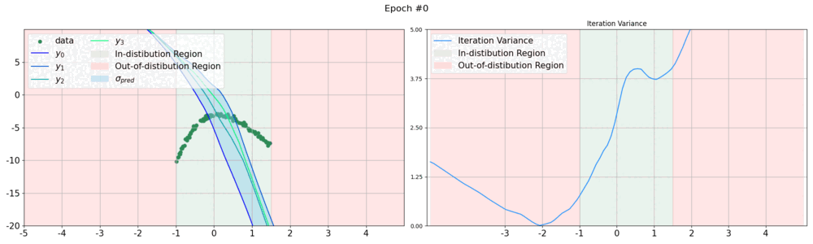
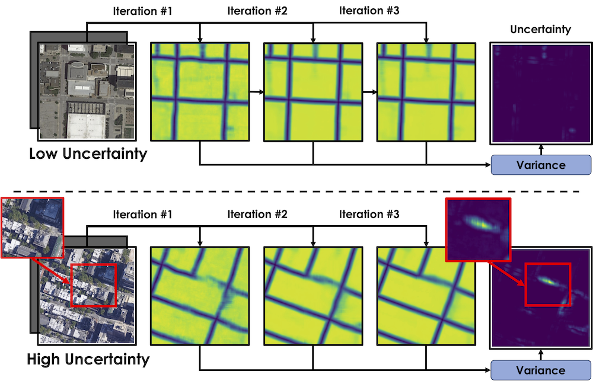

# Enabling Uncertainty Estimation in Iterative Neural Networks



[](https://arxiv.org/abs/2403.16732)
[](https://www.python.org/downloads/release/python-31014/)
[](https://pytorch.org/)
[](https://github.com/cvlab-epfl/iter_unc/blob/main/LICENSE)

### [Project Page](https://www.norange.io/projects/unc_iter/) | [ICML Paper]() | [Poster](https://icml.cc/virtual/2024/poster/34213)


## Abstract

Turning pass-through network architectures into iterative ones, which use their own output as input, is a well-known approach for boosting performance. In this paper, we argue that such architectures offer an additional benefit: The convergence rate of their successive outputs is highly correlated with the accuracy of the value to which they converge. Thus, we can use the convergence rate as a useful proxy for uncertainty. This results in an approach to uncertainty estimation that provides state-of-the-art estimates at a much lower computational cost than techniques like Ensembles, and without requiring any modifications to the original iterative model. We demonstrate its practical value by embedding it in two application domains: road detection in aerial images and the estimation of aerodynamic properties of 2D and 3D shapes. 

## TL;DR



**Uncertainty in recursive models:** Such models use their initial predictions as inputs to produce subsequent predictions. We display the output of three consecutive iterations of a network trained to compute distance maps to road pixels. **(Top:)** All roads are clearly visible. The three maps are similar and the per pixel variance is low. **(Bottom:)** The road in the red square is tree-covered. It is eventually detected properly but the variance is high.

## Experiments

### 1D Regression 

**Uncertainty Estimation for Regression:** The task is to regress $y$-axis values for $x$-axis data points drawn from the range $x \in [-1, 1.3]$ using a third-degree polynomial with added Gaussian noise. The method displays higher uncertainty or iteration variance for out-of-distribution inputs and lower for in-distribution samples.

[](https://colab.research.google.com/github/cvlab-epfl/iter_unc/blob/main/exps/notebooks/toy_regression.ipynb)

### MNIST Classification (TBD)

**MNIST vs FashionMNIST:** We train the networks on MNIST and compute the accuracy and calibration metrics (rAULC). We then use the uncertainty measure they produce to classify images from the test sets of MNIST and FashionMNIST as being within the MNIST distribution or not to compute the OOD metrics, ROC- and PR-AUCs. We use a standard architecture with several convolution and pooling layers, followed by fully connected layers with LeakyReLU activations.

[]()

### Delineation Experiments (TBD)

In these experiments, we focus on the delineation task, particularly for road detection in aerial imagery. This task requires precise identification and outlining of narrow, intricate features within varied image datasets. Our experiments utilized the U-Net architecture, known for its efficacy in image segmentation. We employed it to classify pixels within the images as belonging to the target structures (roads) or not, producing a binary map as the final output. The networks were trained and tested on two public datasets, "RoadTracer" and "Massachusetts," which encompass a diverse range of urban and rural landscapes, thereby providing a comprehensive benchmark for our methods.

## Citation

If you find this code useful, please consider citing our paper:

> Durasov, Nikita, et al. "Enabling Uncertainty Estimation in Iterative Neural Networks", ICML, 2024.

```bibtex
@inproceedings{
    durasov2024enabling,
    title={Enabling Uncertainty Estimation in Iterative Neural Networks},
    author={Nikita Durasov and Doruk Oner and Jonathan Donier and Hieu Le and Pascal Fua},
    booktitle={Forty-first International Conference on Machine Learning},
    year={2024}
}
``` 
